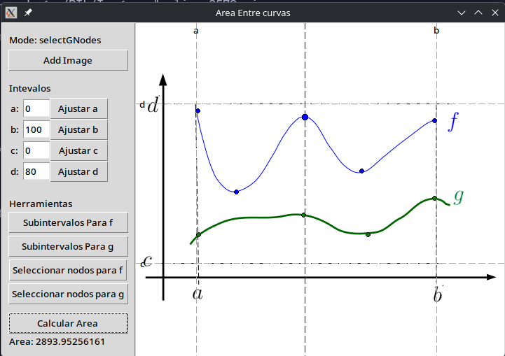

# projecto-de-calculo

# Parte 1



## Como correr el programa
Primero debemos instalar las dependencias necesarias
```bash
python -m venv env
source ./env/bin/activate
# si usas fish
# source ./env/bin/activate.fish

python -m pip install numpy scipy pillow
```

Para correr la interfaz la ejecutamos con
```bash
python seccionPractica/parte1.py
```

## Manual de usuario (Como uso esta herramienta)
Ejecutando la aplicacion veras un panel a la izquierda con varios botones y un recuadro blanco a la derecha.
El primer paso es cargar la imagen con el boton de `cargar imagen`.

Luego configuramos los valores del intervalo $[a, b]$ (intervalo horizontal) y el intervalo $[c, d]$ (intervalo vertical)
en las cajas de texto de la sección de intervalos, luego con el boton de `ajustar a` puedes ajustar visualmente donde
está `a` en la imagen, haciendo click sobre la imagen en la posición deseada, si haces click derecho se deselecciona,
debes hacer lo mismo con los valores de `b` `c` y `d`.

Ahora puedes **(o no)** dividir las funciones `f` y `g` en intervalos con los botones `subintervalos para f` y `subintervalos para g`
al darle click en la imagen creas la division, con el click derecho borras la ultima division creada, solo puedes crear 2
divisiones para un total de 3 subintervalos por funcion. Los subintervalos son distintos para cada función, y cada division
crea un nodo de interpolacion para la funcion.

Por ultimo definimos los nodos de interpolacion, haz click en `seleccionar nodos para f` o `seleccionar nodos para g`,
luego has click en la imagen para posicionar un nodo de interpolacion, con click derecho eliminas el último nodo de interpolación,
los nodos que esten fuera de `[a, b]` y/o `[c, d]` no seran tomados en cuenta en la aproximación, igualmente los nodos
que no esten dentro de los subintervalos definidos por las divisiones en el paso anterior no serán tomados en cuenta para
el calculo del área de la función en ese subintervalo.

Los ultimos 3 pasos (configurar los valores de los intervalos, configurar los subintervalos y los nodos de interpolacion),
no necesariamente se deben realizar en ese ordem, pero ese flujo es el más intuitivo.

Por ultimo seleccionamos el botón de `Calcular Area` para aproximar el area entre las dos curvas.
El resultado se mostrará debajo del boton de `Calcular Area`

# Parte 2
## Como correr el programa
Para correr la segunda parte ejecutamos
```bash
python seccionPractica/parte2.py
```

## Manual de usuario
Al igual que la primera parte veras un panel en la izquierda con varios botones y un recuadro blanco a la derecha.
El primer paso es cargar la imagen con el boton de `cargar imagen`.

Luego posicionamos los interpolantes de la función f con el boton `seleccionar nodo para f` y haciendo click
sobre la función en la imagen, lo realiza lo mismo con para la función g con el boton `seleccionar nodo para g`.

Puedes remover el último punto con el click derecho, puedes quitar todos los nodos con el boton `limpiar nodos`.

Para visualizar la aproximación de las funciones seleccionamos `Generar función`, puedes ocultar la imagen
con el boton `Ocultar imagen` para visualizar mejor la aproximación.

Para Terminar calculamos el área entre las curvas de nivel con el botton `Calcular Area`.


